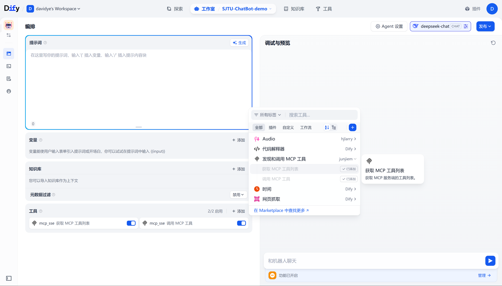

# SJTU-Chatbot：基于 LLMs API、Dify 与 MCP 的校园信息服务个人助手

SJTU-Chatbot 是一个基于 Dify、利用 LLMs API 与 MCP 服务器交互的校园信息服务个人助手，通过[本地部署并配置 Dify 社区版](https://docs.dify.ai/zh-hans/getting-started/install-self-hosted/docker-compose)，再结合本地运行的 SJTU-Chatbot MCP Server，即可利用 Dify 社区版作为前端界面进行交互，亦可以利用 Dify 的高扩展性，结合 [LangBot](https://github.com/RockChinQ/LangBot)、[Dify-FeiShu-bot](https://github.com/Mr-KID-github/Dify-FeiShu-bot) 等

SJTU-Chatbot MCP Server 是一个基于 FastMCP 的服务器实现，专为上海交通大学校园信息服务集成设计。它提供了与 jAccount 认证系统的无缝集成，以及一套灵活的工具开发框架，使开发者能够轻松创建并部署需要利用 jAccount 登录状态访问信息资源的 Python 脚本（tools）。

## 环境要求

- **Python**: 推荐使用 3.12.9
- **操作系统**: Windows, macOS, Linux
- **依赖**: 参考 `requirements.txt`

## 安装配置

### 1. 克隆本仓库

```bash
git clone https://github.com/ysd1123/sjtu_chatbot_demo_v3.git
cd sjtu_chatbot_demo_v3
```

### 2. 创建虚拟环境

```bash
# 使用 venv 创建虚拟环境
python -m venv .venv

# 激活虚拟环境
# Windows
.venv\Scripts\activate
# macOS/Linux
source .venv/bin/activate
```

### 3. 安装依赖

```bash
pip install -r requirements.txt
```

### 4. 安装 Docker Compose

详情见 [Docker 官方文档](https://docs.docker.com/compose/install/)，推荐安装 Docker Desktop。

### 5. Docker Compose 部署 Dify 社区版

详情见 [Dify 使用文档](https://docs.dify.ai/zh-hans/getting-started/install-self-hosted/docker-compose)。

```bash
# 克隆 Dify 源代码至本地环境
git clone https://github.com/langgenius/dify.git --branch main
# 进入 Dify 源代码的 Docker 目录
cd dify/docker
# 复制环境配置文件
cp .env.example .env
# 启动 Docker 容器（Docker Compose V2）
docker compose up -d
# 关闭 Docker 容器
docker compose down
```

## 快速开始

### 启动 MCP 服务器

项目提供了一个测试脚本 `test.py`，可以快速启动 MCP 服务器：

```bash
cd sjtu_chatbot_demo_v3
python test.py
```

这将启动 MCP 服务器，默认监听 `0.0.0.0:1896`。首次启动时，系统会提示您输入 jAccount 用户名和密码进行登录。登录过程中还会要求用户输入图形验证码，其中验证码图片会保存在 `sjtu_chatbot\config\cache` 路径下。

`test.py` 还支持以下命令行参数（一般不需要指定这些参数）：

- `--port PORT`: 指定服务器端口（默认：1896）
- `--debug`: 启用调试日志
- `--no-login`: 跳过 jAccount 登录检查（仅在已有有效 jAccount 会话时可用）

服务器启动后，可以通过浏览器访问以下地址验证服务是否正常运行：

```
http://localhost:1896/mcp
```

如果一切正常，我们将会看到一个 JSON 响应，表示 MCP 服务器已成功启动。

### 在 Dify 社区版中配置

#### 启动 Dify Docker 容器

首先，进入 `dify/docker` 文件夹下，启动 Docker 容器：

```bash
cd dify/docker
docker compose up -d
```

#### 创建 Dify 应用

在浏览器访问 `http://localhost/apps`，即可进入 Dify 社区版的前端管理页面。

在顶部 `工作室` 菜单中，选择 `创建应用-创建空白应用`，`选择应用类型` 处选择 `Agent`，再按照要求输入应用名称、配置图标和描述，即可点击 `创建` 按钮。

#### 安装并配置 MCP SSE / StreamableHTTP 插件

点击右上角的 `插件`，再在左上角点击 `探索 Marketplace`，在 [Marketplace](http://localhost/plugins?category=discover) 搜索框搜索 `MCP SSE / StreamableHTTP`，安装 [MCP SSE / StreamableHTTP](https://marketplace.dify.ai/plugins/junjiem/mcp_sse) 工具（注意是 `工具` 而非 `AGENT 策略`）。

安装完成后，点击顶部菜单的 `工具`，在列表中找到刚刚安装的 `MCP SSE / StreamableHTTP`，点击后，右侧会弹出窗口，点击 `设置授权` 进行配置凭据。

在 `MCP 服务配置` 中输入以下配置（Docker 容器内访问宿主机 `localhost` 需要使用 `host.docker.internal`）：

```
{"SJTU-ChatBot-MCP":{"transport":"streamable_http","url":"http://host.docker.internal:1896/mcp","headers":{},"timeout":50,"sse_read_timeout":50}}
```

点击保存，若没有报错说明配置成功。

#### 在 Dify 应用中配置 MCP 服务器 Tools 以及 LLMs API

点击顶部 `工作室` 菜单，再点击进入刚刚创建的 Dify 应用，在右上角配置大模型 API，在左侧 `工具` 选项卡中配置好 `发现和调用 MCP 工具`，即可体验。



## 工具开发指南

### 工具结构

SJTU-Chatbot MCP 服务器使用装饰器模式注册工具。每个工具都是一个 Python 函数，通过 `@register_tool` 装饰器注册到 MCP 服务器。

基本结构如下：

```python
from sjtu_chatbot.mcp_server import register_tool, SJTUContext
from typing import Dict, Any

@register_tool(
    name="my_tool",                   # 工具名称
    description="这是工具描述",        # 工具描述
    require_login=True                # 是否需要登录
)
def my_tool(context: SJTUContext) -> Dict[str, Any]:
    """
    我的工具函数
    
    参数:
        context: MCP 上下文对象，包含会话信息
        
    返回:
        结果字典
    """
    # 检查登录状态
    if not context.is_logged_in():
        return {
            "success": False,
            "message": "用户未登录，请先登录 jAccount"
        }
    
    # 获取会话对象，用于访问需要认证的资源
    session = context.session
    
    # 实现工具逻辑
    # ...
    
    # 返回结果
    return {
        "success": True,
        "data": "工具执行结果"
    }
```

### 工具注册

工具注册通过 `@register_tool` 装饰器完成，支持以下参数：

- `name`: 工具名称（必填）
- `description`: 工具描述（必填）
- `require_login`: 是否需要登录（默认为 True）

工具函数必须接受 `context: SJTUContext` 作为第一个参数，并返回一个可 JSON 序列化的对象（通常是字典）。

### 访问受限资源

通过 `context.session` 获取已认证的 requests.Session 对象，用于访问需要 jAccount 认证的资源：

```python
@register_tool(
    name="get_grades",
    description="获取成绩单",
    require_login=True
)
def get_grades(context: SJTUContext):
    # 检查登录状态
    if not context.is_logged_in():
        return {"success": False, "message": "用户未登录"}
    
    # 获取已认证的会话
    session = context.session
    
    # 使用会话访问需要认证的资源
    response = session.get("https://i.sjtu.edu.cn/api/grades")
    
    # 处理响应
    if response.status_code == 200:
        return {
            "success": True,
            "grades": response.json()
        }
    else:
        return {
            "success": False,
            "message": f"获取成绩失败: {response.status_code}"
        }
```

### 工具目录结构

工具应放置在 `sjtu_chatbot/tools` 目录下，每个工具模块应包含一个或多个使用 `@register_tool` 装饰的函数。

推荐的目录结构：

```
sjtu_chatbot/
├── tools/
│   ├─ base/
│   │  ├─ data_utils.py
│   │  └─ __init__.py
│   ├─ account_info.py
│   ├─ ...
│   └─ __init__.py
```

MCP 服务器启动时会自动扫描 `sjtu_chatbot/tools` 目录下的所有模块，并注册使用 `@register_tool` 装饰的函数。

### 架构概述

SJTU-Chatbot MCP 服务器基于 Model Context Protocol 实现，主要组件包括：

1. **MCPStreamableHTTPServer**: 核心服务器类，实现 MCP Streamable HTTP 协议
2. **SJTUContext**: 上下文类，提供 jAccount 会话和登录状态管理
3. **工具注册机制**: 通过装饰器自动注册和管理工具
4. **jAccount 集成**: 提供与上海交通大学 jAccount 系统的认证集成

### 服务器启动流程

在其他自定义的应用中启动 MCP 服务器的标准流程如下：

```python
from sjtu_chatbot.mcp_server import create_mcp_server, JAccountLoginManager

# 初始化 jAccount 登录管理器
jaccount_login = JAccountLoginManager.get_instance()

# 确保已登录（可选）
if not jaccount_login.is_logged_in():
    jaccount_login.ensure_logged_in()

# 创建 MCP 服务器
mcp_server = create_mcp_server()

# 启动服务器
mcp_server.run(host="0.0.0.0", port=1896)
```

### 自定义配置

可以在创建服务器时指定 jAccount 配置文件路径：

```python
from pathlib import Path
from sjtu_chatbot.mcp_server import create_mcp_server

# 指定配置文件路径
config_path = Path("./custom_jaccount_config.json")
mcp_server = create_mcp_server(config_path=config_path)
```

## jAccount 登录集成

### 登录流程

SJTU-Chatbot MCP 服务器提供了与 jAccount 系统的无缝集成，支持以下登录方式：

1. **交互式登录**: 通过命令行提示输入用户名和密码
2. **程序化登录**: 直接提供用户名和密码

示例：

```python
from sjtu_chatbot.mcp_server import JAccountLoginManager

# 获取登录管理器实例
jaccount_login = JAccountLoginManager.get_instance()

# 方式 1: 交互式登录（会提示用户输入）
jaccount_login.ensure_logged_in()

# 方式 2: 程序化登录
jaccount_login.login_with_password("your_username", "your_password")
```

使用交互式登录时，会提示用户在命令行分别输入账号、密码以及验证码，其中验证码图片会保存在 `sjtu_chatbot\config\cache` 路径下。

### 会话管理

登录成功后，系统会自动保存会话信息到配置文件（默认为 `sjtu_chatbot/config/jaccount_config.json`），下次启动时会尝试使用保存的会话。

您可以启动会话监控，自动处理会话过期情况：

```python
from sjtu_chatbot.mcp_server import JAccountLoginManager

jaccount_login = JAccountLoginManager.get_instance()

# 定义会话失效时的回调函数
def login_callback():
    print("会话已失效，尝试重新登录")
    jaccount_login.ensure_logged_in()

# 启动会话监控
jaccount_login.start_session_monitor(login_callback)

# 在程序结束时停止监控
jaccount_login.stop_session_monitor()
```

### 检查登录状态

在工具实现中，您可以随时检查用户是否已登录：

```python
def my_tool(context):
    if not context.is_logged_in():
        return {"success": False, "message": "用户未登录，请先登录 jAccount"}
    
    # 继续处理...
```

## 部署建议

### 开发环境

对于开发和测试，直接使用 `test.py` 启动服务器即可：

```bash
python test.py
```

### 生产环境

对于生产环境，建议使用 Gunicorn 或 Uvicorn 作为 ASGI 服务器：

```bash
# 使用 Uvicorn
uvicorn sjtu_chatbot.mcp_server.server:app --host 0.0.0.0 --port 1896 --workers 4

# 使用 Gunicorn 和 Uvicorn worker
gunicorn sjtu_chatbot.mcp_server.server:app -w 4 -k uvicorn.workers.UvicornWorker -b 0.0.0.0:1896
```

## 许可证声明

本项目基于 GPL-3.0 许可证开源。

### 第三方代码使用声明
本项目参考了以下开源项目的部分代码：

- **原始仓库**: [SJTU-Geek/sjtu-mcp-server](https://github.com/SJTU-Geek/sjtu-mcp-server)、[SJTU-Geek/sjtu-mcp-contrib](https://github.com/SJTU-Geek/sjtu-mcp-contrib)
- **许可证**: GPL-3.0
- **使用情况**: 来自于 [scripts](https://github.com/SJTU-Geek/sjtu-mcp-contrib/tree/master/scripts) 下的部分 Python tools，但根据本项目 MCP 服务器实现的具体情况进行了大量适配、重构优化以及 Bug 修复。
